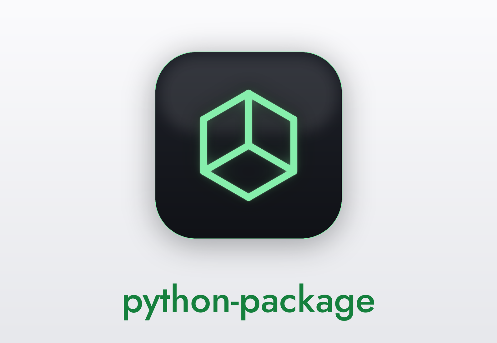

[](https://my_package.readthedocs.io/en/latest/?badge=latest)
[](https://codecov.io/gh/mahynski/my_package)
[](https://github.com/pre-commit/pre-commit)
[](https://github.com/astral-sh/ruff)
<!-- Uncomment after Zenodo mints a DOI for this repo and replace {github_id}.
[](https://zenodo.org/badge/latestdoi/{github_id})
-->


PyPI Package Template Instructions
===

<picture>
  <source media="(prefers-color-scheme: dark)" srcset="logo-dark.png" />
  
</picture>

1. Choose a name that does not exist in [pypi](https://pypi.org/). You can check by going to `https://pypi.org/simple/{my_awesome_new_package}`; a 404 means the name is available.
2. Run the personalization script. It rewrites every place the original author's identity is baked in (package name, GitHub username, author name, email, ORCID, codecov token) and renames the `my_package/` directory in one shot:

```bash
scripts/personalize.sh \
  --name my_awesome_new_package \
  --username my-github-handle \
  --author "Jane Doe" \
  --email jane@example.com \
  --orcid 0000-0001-2345-6789      # optional; line is dropped from CITATION.cff if omitted
```

Review the diff (`git diff`), then commit. Once you're satisfied you can delete the script with `rm -r scripts/`.

3. Replace the placeholder `LICENSE.md` with the full text of your chosen license (see [choosealicense.com](https://choosealicense.com/)) and update the `license` field in `pyproject.toml` accordingly. Per [PEP 639](https://peps.python.org/pep-0639/), prefer an SPDX expression: `license = "MIT"`.
4. Replace `docs/_static/logo.png` and `logo_transparent.png` with your own art (or remove `html_logo` from `docs/conf.py`). The committed art is AI-generated `my_package` placeholder.
5. Once codecov is enabled for the new repo, replace `REPLACE_WITH_CODECOV_TOKEN` in `README.md` and `docs/index.rst` with your project's token.
6. Get coding! Follow the best practices below.  When you are ready to publish, proceed to the next step.
7. Before tagging a release, update **all** of:
   - `__version__` in `my_package/__init__.py`
   - `version:` and `date-released:` in `CITATION.cff` (and the `doi:` once Zenodo mints it)
   - the `Development Status` classifier in `pyproject.toml`
8. When finished, first enable preservation of this repo on [Zenodo](https://zenodo.org/), then create a release on GitHub. Zenodo will detect the new release and mint a DOI and badge. Update the `{github_id}` placeholder in this `README.md` and in `docs/index.rst` with the ID generated by Zenodo.
9. Follow [these instructions](https://packaging.python.org/en/latest/tutorials/packaging-projects/) to publish to PyPI.
10. The included GitHub Actions workflows trigger on pushes and PRs to `main`. If you adopt a `dev` → `main` pattern for releases, update the `on:` blocks in `.github/workflows/*.yml` so CI runs on `dev` too.

Best Practices
===

Environment
---

Create a conda/mamba environment, then install the package in editable mode so changes are picked up immediately during development.

```bash
mamba create -n awesome_env python=3.12
mamba activate awesome_env
cd my_awesome_new_package
pip install -e ".[dev]"                                 # editable install with dev/test/docs/notebook extras
python -m ipykernel install --user --name=awesome_env   # register Jupyter kernel
jupyter notebook --port 4321                            # launch on localhost (default auth enabled)
```

Or, using [uv](https://docs.astral.sh/uv/) (a fast drop-in for `pip` and `venv` from Astral):

```bash
uv venv awesome_env --python 3.12                       # create virtual env in ./awesome_env
source awesome_env/bin/activate                         # Windows: awesome_env\Scripts\activate
cd my_awesome_new_package
uv pip install -e ".[dev]"                              # editable install with dev/test/docs/notebook extras
python -m ipykernel install --user --name=awesome_env   # register Jupyter kernel
jupyter notebook --port 4321                            # launch on localhost (default auth enabled)
```

The package declares the following extras in `pyproject.toml`. The default
`dependencies` list is **empty** on purpose — add only what your package
actually imports. The `science` extra is opt-in so users who don't need it
aren't forced to install hundreds of MB of wheels.

- `science` — `matplotlib`, `numpy`, `pandas`, `scikit-learn`, `scipy`, `seaborn` with loose floors
- `test` — `pytest` + `pytest-cov` (what CI installs)
- `docs` — Sphinx and the theme/extensions used by `docs/conf.py`
- `notebook` — `IPython`, `ipywidgets`, `ipykernel`
- `dev` — superset of the above plus `pre-commit` and `mypy`

Note: don't disable Jupyter's token/password or bind it to `0.0.0.0` unless you understand the access implications. The default (localhost + token) is the safe choice.

Documentation
---

Documentation lives in `docs/` and is built with [Sphinx](https://www.sphinx-doc.org/en/master/). Sphinx and the extensions enabled in `docs/conf.py` are declared as the `docs` extra in `pyproject.toml`, so a single editable install pulls everything in:

```bash
pip install -e ".[docs]"
cd docs
bash make_docs.sh
```

Adjust the landing page in `docs/index.rst` manually — see the [reStructuredText primer](https://www.sphinx-doc.org/en/master/usage/restructuredtext/basics.html).

For hosted docs, link the repo at [Read the Docs](https://about.readthedocs.com/). The `.readthedocs.yml` installs the package with its `docs` extra so the build matches the pinned toolchain in `pyproject.toml`.

To start fresh, run `sphinx-quickstart` in `docs/`.

Unittests
---

Add [unittests](https://docs.python.org/3/library/unittest.html) in `tests/`. `pyproject.toml` configures pytest to look there automatically.

```bash
python -m pytest
```

`.github/workflows/python-app.yml` runs these tests and reports coverage on every push and pull request to `main`. Edit the `on:` triggers if you want the workflow to run on other branches too.

Code coverage is wired to [codecov.io](https://app.codecov.io/). Enable the repo there, add your `CODECOV_TOKEN` as a [GitHub Actions secret](https://docs.github.com/en/actions/security-for-github-actions/security-guides/using-secrets-in-github-actions), and update the badge URL in this `README.md` and in `docs/index.rst` (find it under *Configuration → Badges & Graphs* on codecov).

CI/CD
---

The template ships CI for **both GitHub and GitLab** so you can host on either
without rewriting pipelines. The two configs are kept behaviorally equivalent
for the test stage (same Python matrix, same install command, same coverage
report). When you change one, **mirror the change in the other**; both files
have a `KEEP IN SYNC` header pointing at the other.

GitHub-specific workflows (with no GitLab equivalent in this template):

- `.github/workflows/python-app.yml` — test matrix on 3.10–3.13, coverage to Codecov.
- `.github/workflows/pre-commit.yml` — runs pre-commit hooks on push and PR to `main`.
- `.github/workflows/codeql.yml` — [CodeQL](https://codeql.github.com/) static analysis on push, PR, and weekly Mondays. Findings appear under *Security → Code scanning*.
- `.github/dependabot.yml` — weekly PRs to update GitHub Actions and pip dependencies. Tune `interval` or `open-pull-requests-limit` if volume is too high.

GitLab equivalent:

- `.gitlab-ci.yml` — mirrors the test matrix and adds `pre-commit` and `mypy` jobs. CodeQL has no GitLab analogue here; if you host on GitLab, consider GitLab's built-in [SAST](https://docs.gitlab.com/ee/user/application_security/sast/) instead.
- **No Dependabot on GitLab.** If you host on GitLab, consider [Renovate](https://docs.renovatebot.com/) (works on both platforms) or replace `.github/dependabot.yml` with a manual update cadence.

Linting and Formatting
---

Linting and formatting are handled by [ruff](https://docs.astral.sh/ruff/) via [pre-commit](https://pre-commit.com/). See `.pre-commit-config.yaml` for the full hook configuration.

Install the hooks once, then they'll run on every commit:

```bash
pre-commit install
```

To run all hooks against the whole repo on demand:

```bash
pre-commit run --all-files
```

Typing
---

Type hints are optional but recommended — see the [typing docs](https://docs.python.org/3/library/typing.html) and [mypy](https://mypy-lang.org/). [Mypy](https://mypy-lang.org/) is configured under `[tool.mypy]` in `pyproject.toml` and runs in CI on every push/PR (the GitHub `python-app.yml` test job runs it on Python 3.12; the GitLab `mypy` job runs in the `lint` stage). The package ships a [PEP 561](https://peps.python.org/pep-0561/) `py.typed` marker so downstream consumers see your annotations.

Run mypy locally the same way CI does:

```bash
pip install -e ".[dev]"
mypy my_package
```

The default config is permissive (`ignore_missing_imports`, `check_untyped_defs`, no `disallow_untyped_defs`) so a fresh template checkout passes without effort. Tighten it as your code grows — e.g., flip on `disallow_untyped_defs = true` once you're ready to require annotations on public APIs.

Demo
---

If your package benefits from a UI, consider a [Streamlit](https://streamlit.io/) demo (free hosting via the [community cloud](https://streamlit.io/cloud)) or a [Hugging Face Space](https://huggingface.co/spaces). Either works directly from a public repo.

Logo
---

Generate a logo with [Google Gemini](https://gemini.google.com/app) or any other AI tool, save it under `docs/_static/`, and point the `html_logo` setting in `docs/conf.py` at the new file. If you use an AI-generated image, [cite it](https://lib.guides.umd.edu/c.php?g=1340355&p=9896961) — name the tool, the company, and the prompt.

The logo for this repository (`docs/_static/logo.png`) was generated with Google Gemini (Imagen 3) on Nov. 28, 2024 from the prompt: *"Make a logo inspired by code as a template for python projects."*

Citation
---

Update `CITATION.cff`, `CODEOWNERS`, and `pyproject.toml` to list all authors and maintainers. The CITATION format is documented at [citation-file-format.github.io](https://citation-file-format.github.io/).
